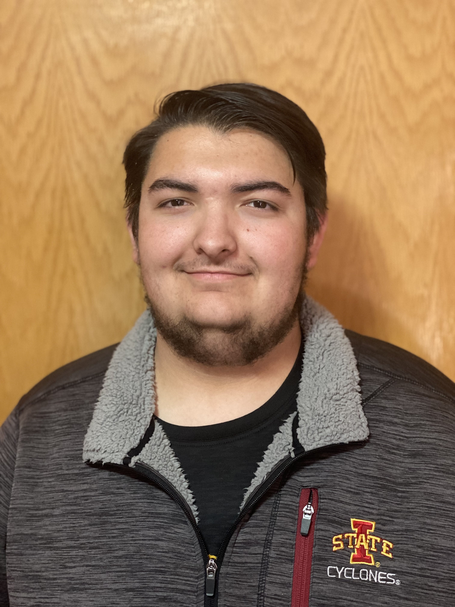

Ryan Majstorovic Portfolio
==========================

Welcome
-------

I am an Electrical Engineering student at Iowa State University focused on
embedded systems, hardware design, and signal processing. I have hands-on
experience building and debugging microcontroller-based systems, sensor
interfaces, and custom PCBs. I currently work as a part-time student engineer
at John Deere, where I apply structured testing, documentation, and
problem-solving to real engineering programs. This portfolio highlights my
journey through Iowa State University.

Contact Information
----------------------------

- Email: `RyanMajstorovic@gmail.com <mailto:RyanMajstorovic@gmail.com>`_
- LinkedIn: `Link <https://www.linkedin.com/in/ryan-majstorovic/>`_

Career Objective
----------------

My career goal is to work in embedded systems and hardware design, ideally in
instrumentation or semiconductor-adjacent roles where signal integrity and
measurement quality matter. I want to build systems that connect hardware and
firmware, including sensor-driven embedded platforms, data acquisition
solutions, and mixed-signal or RF front ends. My current focus is to continue
growing through industry work while finishing my degree, then move into a full
time role and continue my education with an M.Eng. in Electrical Engineering.

Portfolio Navigation
------------------------

.. toctree::
   :maxdepth: 2
   :caption: Contents:

   senior_design
   additional_projects
   technical_experience
   resume_and_achievements
   reflections
   ethics_paper

