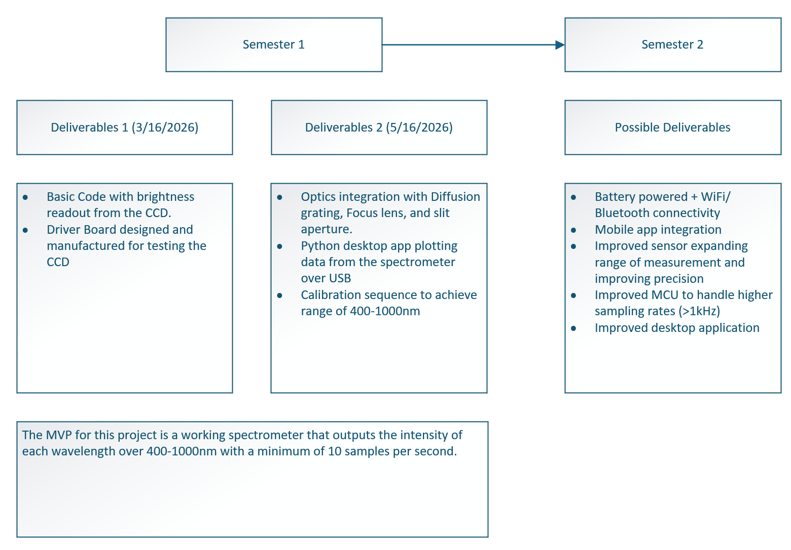

Senior Design Project
=====================

Cost Effective NIR-VIS Spectrometer (Spectro)
----------------------------------------------

**Status:** In progress (Spring 2026 to Fall 2026)

:ref:`Project Website <https://sddec26-06.sd.ece.iastate.edu>`

Description of Project
----------------------

Problem Statement
~~~~~~~~~~~~~~~~~

Many labs and research teams need an affordable, portable way to measure
optical spectra in the visible to near-infrared range without relying on
expensive bench-top instruments. This project targets a cost-effective
spectrometer that captures spectra from 400 nm to 1000 nm and streams results
to a PC for analysis.

Requirements and Constraints
~~~~~~~~~~~~~~~~~~~~~~~~~~~~

- Wavelength range: 400 nm to 1000 nm (VIS to NIR)
- Form factor: module-based design (optics, analog detection, digital
  processing as separable subsystems)
- Interface: digitize detector output and send data to a PC over USB
- Schedule: early focus on CCD driver PCB and MCU interface, optics refined
  in the seond half of semester one.
- Cost, size, and power targets: in definition with advisor

System Overview
~~~~~~~~~~~~~~~

The spectrometer uses a light source and an optical path (slit, lens,
mirror, diffraction grating) to disperse incoming light across a linear
CCD (1 x 3680 pixels). The CCD output is conditioned and digitized, then a
STM32F411 microcontroller packages sampled pixel data and transmits it to a PC
over USB for plotting and analysis.

Key Technical Components
~~~~~~~~~~~~~~~~~~~~~~~~

- Sensor: linear silicon CCD (1 x 3680 pixels)
- MCU: STM32F411 (configured in STM32CubeIDE and CubeMX)
- Optics: light source, slit, lens, mirror, diffraction grating
- Communications: USB link to PC
- Power and enclosure: pending packaging decisions

What Success Looks Like
~~~~~~~~~~~~~~~~~~~~~~~

My Role
---------

Responsibilities
~~~~~~~~~~~~~~~~

- Leading PCB board design work (schematic and layout in
  Autodesk Fusion)
- Implemented EMI and coupling reduction strategy (via fencing and analog
  isolation from clocks/power)
- Helping drive design review, ordering, and parallel development planning.
- Support the coding and optics work as needed, but primary focus is on the CCD driver board and
  MCU interface with desktops.

End-to-End Ownership
~~~~~~~~~~~~~~~~~~~~

Owned CCD driver board v1 from concept through schematic, layout, release for
order, and early bring-up planning for STM32 timing and ADC integration.

Link to CCD driver board pdf overview: `CCD Driver Board PDF <source/_static/pdfs/CCD_Driver_Board.pdf>'

Skills or Knowledge Gained
--------------------------

Technical Skills
~~~~~~~~~~~~~~~~

- PCB design in Autodesk Fusion 
- Mixed-signal noise mitigation techniques
- STM32CubeIDE/CubeMX peripheral workflow
- Timing-critical CCD readout planning
- Optical system design principles for spectroscopy

Engineering Process Skills
~~~~~~~~~~~~~~~~~~~~~~~~~~

- Subsystem decomposition and module-based planning
- Requirement-oriented design review discipline
- Structured validation planning before bring-up

Communication and Project Management
~~~~~~~~~~~~~~~~~~~~~~~~~~~~~~~~~~~~

- Weekly planning in paired subteams with clear ownership
- Advisor-facing progress updates and risk communication

Big Picture Contribution
------------------------

Why It Matters
~~~~~~~~~~~~~~

A low-cost VIS-NIR spectrometer increases access to spectroscopy for teaching
labs, prototyping, and research teams that need frequent measurements without
dedicating expensive shared instruments.

Who Benefits
~~~~~~~~~~~~

University labs, student teams, and researchers working on optical measurement
or material and biological sample analysis.

Next Iteration
~~~~~~~~~~~~~~

- Lock requirements and target user personas with advisor
- Add wavelength calibration and characterization features
- Improve packaging and alignment features
- Evaluate optional wireless connectivity after USB baseline is stable
